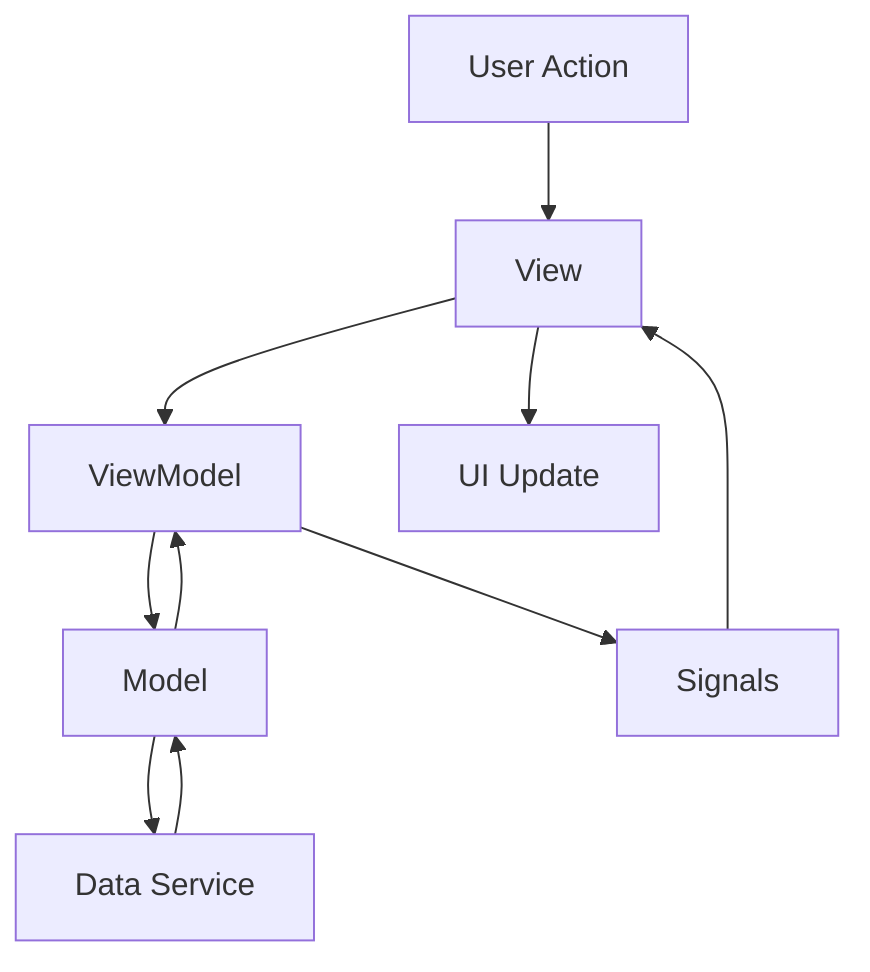

# MVVM Pattern in PyQt

## Overview

The Model-View-ViewModel (MVVM) pattern is a software architectural pattern that facilitates the separation of concerns between the user interface (View) and the business logic (ViewModel), with the data layer (Model) being independent of both.

## Architecture Components

### 🏗️ Model Layer
The Model represents the data and business logic of the application.

```python
class CounterModel:
    def __init__(self, logger, data_service):
        self.count = 0
        self._logger = logger
        self._data_service = data_service
    
    def increment(self):
        self.count += 1
        self._data_service.set_data("counter_count", self.count)
```

**Responsibilities:**
- Data storage and retrieval
- Business logic implementation
- Data validation
- External service integration

### 🎯 ViewModel Layer
The ViewModel acts as a bridge between the Model and View, handling the presentation logic.

```python
class CounterViewModel(QObject):
    count_changed = pyqtSignal(int)
    can_increment_changed = pyqtSignal(bool)
    
    def __init__(self, model, logger):
        self._model = model
        self._logger = logger
        self._thread_manager = ThreadManager(logger)
    
    def increment(self):
        self._thread_manager.execute_task(self._model.increment)
```

**Responsibilities:**
- Data transformation for UI
- Command handling
- State management
- Thread management
- Error handling

### 🖥️ View Layer
The View is responsible for the user interface and user interaction.

```python
class CounterView(QWidget):
    def __init__(self, view_model):
        self._view_model = view_model
        self._view_model.count_changed.connect(self.update_label)
        self._view_model.can_increment_changed.connect(self.update_button)
```

**Responsibilities:**
- UI rendering
- User input handling
- Visual feedback
- Accessibility support

## Data Flow



## Key Benefits

### 1. **Separation of Concerns**
- UI logic is separate from business logic
- Models are independent of UI frameworks
- ViewModels can be tested independently

### 2. **Testability**
- Each layer can be unit tested in isolation
- Mock objects can easily replace dependencies
- UI testing can focus on user interactions

### 3. **Maintainability**
- Changes to UI don't affect business logic
- Business logic changes don't require UI updates
- Code is more modular and reusable

### 4. **Scalability**
- New views can reuse existing ViewModels
- Multiple views can share the same ViewModel
- Models can be used across different UI frameworks

## Implementation Patterns

### Dependency Injection
```python
# Service registration
container.register_singleton(ILogger, LoggerService)
container.register_singleton(IDataService, DataService)

# Dependency resolution
logger = ServiceLocator.get_service(ILogger)
data_service = ServiceLocator.get_service(IDataService)
model = CounterModel(logger, data_service)
```

### Event-Driven Communication
```python
# ViewModel signals
count_changed = pyqtSignal(int)
error_occurred = pyqtSignal(str)

# View connections
view_model.count_changed.connect(self.update_label)
view_model.error_occurred.connect(self.show_error)
```

### Thread Management
```python
# Background task execution
self._thread_manager.execute_task(self._model.heavy_operation)

# Signal handling
self._thread_manager.task_finished.connect(self._on_task_completed)
self._thread_manager.task_error.connect(self._on_task_error)
```

## Best Practices

### 1. **Keep Views Simple**
- Views should only handle UI logic
- Avoid business logic in views
- Use data binding for updates

### 2. **ViewModel Responsibilities**
- Handle all presentation logic
- Manage UI state
- Coordinate between Model and View
- Handle threading and async operations

### 3. **Model Independence**
- Models should not know about UI
- Models should be framework-agnostic
- Models should focus on data and business rules

### 4. **Error Handling**
- Centralize error handling in ViewModels
- Use signals to communicate errors to Views
- Log errors appropriately

### 5. **Testing Strategy**
- Unit test Models and ViewModels
- Integration test the complete flow
- UI tests for critical user paths

## Common Anti-Patterns

### ❌ View-Model Direct Communication
```python
# Bad: View directly accessing Model
class BadView(QWidget):
    def increment(self):
        self.model.count += 1  # Direct model access
```

### ❌ Business Logic in Views
```python
# Bad: Business logic in View
class BadView(QWidget):
    def validate_input(self, value):
        if value < 0:  # Business logic in view
            return False
```

### ❌ Model-View Coupling
```python
# Bad: Model knowing about UI
class BadModel:
    def save(self):
        # Model shouldn't know about UI
        QMessageBox.information(None, "Success", "Data saved!")
```

## Migration Guide

### From MVC to MVVM
1. **Extract ViewModels**: Move presentation logic from Controllers
2. **Update Views**: Connect to ViewModels instead of Models
3. **Refactor Models**: Remove UI dependencies
4. **Add Data Binding**: Implement signal-slot connections

### From Traditional PyQt to MVVM
1. **Separate Concerns**: Identify UI, logic, and data layers
2. **Create ViewModels**: Extract presentation logic
3. **Implement DI**: Add dependency injection
4. **Add Testing**: Create unit tests for each layer 